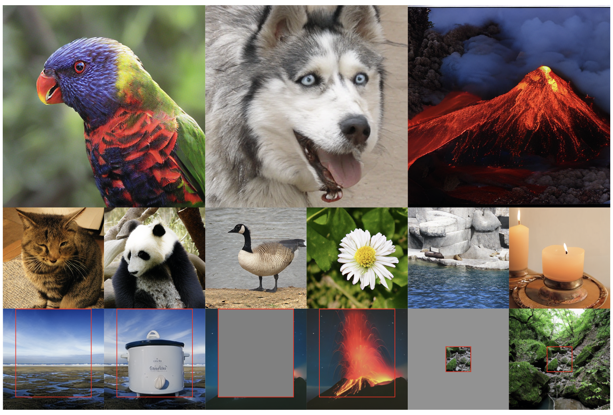
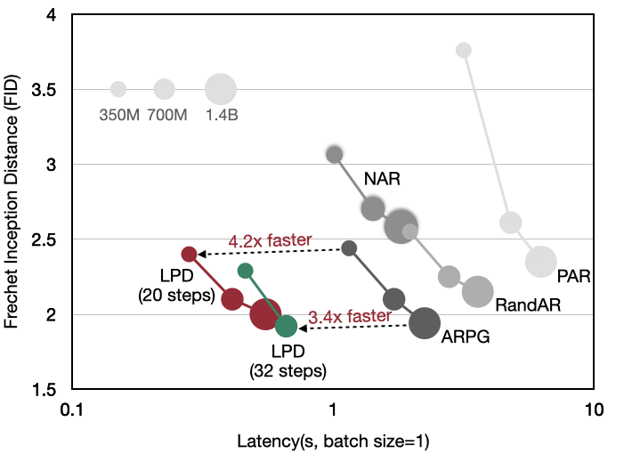

# Locality-aware Parallel Decoding for Efficient Autoregressive Image Generation

### [Paper](https://arxiv.org/abs/2507.01957) | [Model](https://huggingface.co/collections/mit-han-lab/lpd-68658dde87750bacd791e91c)

<p align="left">
    
</p>

## News

\[2025/07\] 🔥 We release the code and [models](https://huggingface.co/collections/mit-han-lab/lpd-68658dde87750bacd791e91c) for LPD!

## Abstract

We present *Locality-aware Parallel Decoding* (LPD) to accelerate autoregressive image generation. Traditional autoregressive image generation relies on next-patch prediction, a memory-bound process that leads to high latency. Existing works have tried to parallelize next-patch prediction by shifting to multi-patch prediction to accelerate the process, but only achieved limited parallelization. To achieve high parallelization while maintaining generation quality, we introduce two key techniques: (1) **Flexible Parallelized Autoregressive Modeling**, a novel architecture that enables arbitrary generation ordering and degrees of parallelization. It uses learnable position query tokens to guide generation at target positions while ensuring mutual visibility among concurrently generated tokens for consistent parallel decoding. (2) **Locality-aware Generation Ordering**, a novel schedule that forms groups to minimize intra-group dependencies and maximize contextual support, enhancing generation quality. With these designs, we reduce the generation steps from 256 to 20 (256x256 res.) and 1024 to 48 (512x512 res.) without compromising quality on the ImageNet class-conditional generation, and achieving at least 3.4x lower latency than previous parallelized autoregressive models.

<p align="left">
    
</p>

## Preparation

### Environment Setup

```bash
git clone https://github.com/mit-han-lab/lpd
cd lpd
bash environment_setup.sh lpd
```

### Models

Download the [LlamaGen tokenizer](https://huggingface.co/FoundationVision/LlamaGen/resolve/main/vq_ds16_c2i.pt) and  place it in ```tokenizers```. Download LPD [models](https://huggingface.co/collections/mit-han-lab/lpd-68658dde87750bacd791e91c) from Huggingface.

| Model                                                          | #Para. | #Steps  | FID-50K | IS              | Latency(s)  | Throughput(img/s) |
|----------------------------------------------------------------|---------|---------|---------|-----------------|-------------|-------------------|
| [LPD-L-256](https://huggingface.co/mit-han-lab/lpd_l_256/tree/main)      | 337M    | 20      | 2.40    | 284.5           |    0.28     |     139.11        |
| [LPD-XL-256](https://huggingface.co/mit-han-lab/lpd_xl_256/tree/main)    | 752M    | 20      | 2.10    | 326.7           |    0.41     |     75.20         |
| [LPD-XXL-256](https://huggingface.co/mit-han-lab/lpd_xxl_256/tree/main)  | 1.4B    | 20      | 2.00    | 337.6           |    0.55     |     45.07         |
| [LPD-L-256](https://huggingface.co/mit-han-lab/lpd_l_256/tree/main)      | 337M    | 32      | 2.29    | 282.7           |    0.46     |     110.34        |
| [LPD-XL-256](https://huggingface.co/mit-han-lab/lpd_xl_256/tree/main)    | 752M    | 32      | 1.92    | 319.4           |    0.66     |     61.24         |
| [LPD-L-512](https://huggingface.co/mit-han-lab/lpd_l_512/tree/main)      | 337M    | 48      | 2.54    | 292.2           |    0.69     |     35.16         |
| [LPD-XL-512](https://huggingface.co/mit-han-lab/lpd_xl_512/tree/main)    | 752M    | 48      | 2.10    | 326.0           |    1.01     |     18.18         |


### Dataset

If you conduct training, please download [ImageNet](http://image-net.org/download) dataset and palce it in your ```IMAGENET_PATH```. To accelerate training, we recommend precomputing the tokenizer latents and saving them to ```CACHED_PATH```. Please set the ```--img_size``` to either 256 or 512.

```bash
torchrun --nproc_per_node=8 --nnodes=1 \
main_cache.py \
--img_size 256 --vqgan_path tokenizers/vq_ds16_c2i.pt \
--data_path ${IMAGENET_PATH} --cached_path ${CACHED_PATH}
```

<!-- [Download](https://huggingface.co/datasets/Efficient-Large-Model/imagenet-llamagen-cache) the pre-cached llamagen discrete tokens for ImageNet. Then unzip：

```
tar -xvf imagenet_llamagen_cache.tar -C /your-local-path/imagenet_llamagen_cache
``` -->

## Usage

### Evaluation 

First, generate the LPD orders. Alternatively, you may [download](https://huggingface.co/mit-han-lab/lpd_orders/tree/main) the pre-generated orders and place them in ```orders/lpd_orders_generated```.

```bash
bash orders/run_lpd_order.sh
```

Then, run the evaluation scripts located in ```scripts/eval```. For example, to evaluate LPD-L-256 using 20 steps:

```bash
bash scripts/eval/lpd_l_res256_steps20.sh
```

Note: Please set ```--pretrained_ckpt``` to the path of the downloaded LPD model, and specify ```--output_dir```.

### Training

Run the training scripts located in ```scripts/train```. For example, to train LPD-L-256:

```bash
python scripts/cli/run.py -J lpd_l_256 -p your_slurm_partition -A your_slurm_account -N 4 bash scripts/train/lpd_l_256.sh 
```

### Acknowledgements

Thanks to [MAR](https://github.com/LTH14/mar/tree/main) for the wonderful open-source codebase.

We thank MIT-IBM Watson AI Lab, National Science Foundation, Hyundai, and Amazon for supporting this research.